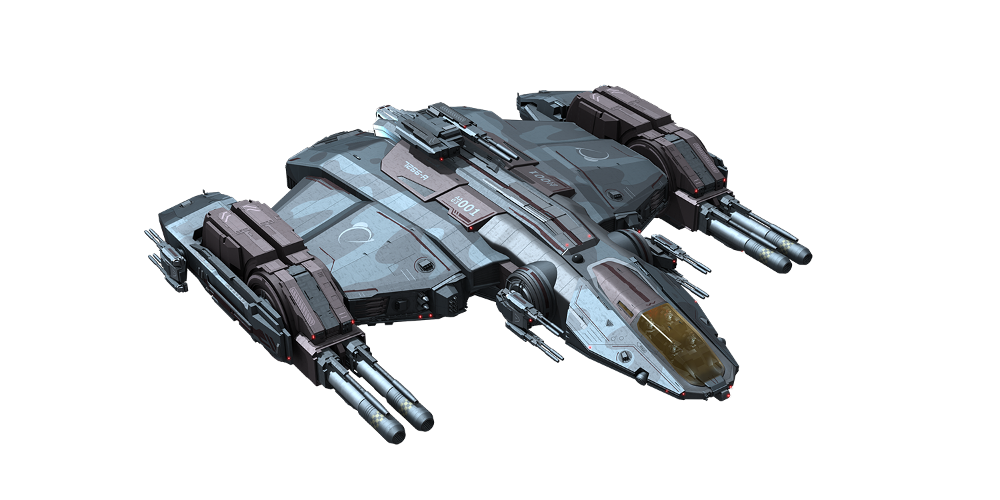

# SPACE CONQUER

## [Play the Game!](https://antkera.github.io/SpaceConquer/)

# Description

"Space Conquer" is an exciting space strategy game where you take control of a powerful spaceship with the mission to conquer planets before an enemy ship. You find yourself in a vast universe filled with unexplored planets. You must navigate space, build a powerful army to defend your conquests, and compete with the enemy ship.

Explore a universe with a variety of unique and challenging planets.
Recruit a crew to enhance your strategic position.
Manage resources to colonize planets and strengthen your empire.
Face off against the enemy ship in epic battles to compete for galactic dominance.
"Space Conquer" immerses you in an exciting intergalactic conflict where strategy and decision-making are key to securing your victory over the enemy ship and achieving galactic conquest. Do you have what it takes to lead your ship to victory in this cosmic battle?

# Main Functionalities

- Clicking on a planet allows you to travel to it and initiate an attack or a recharge.

- If you manage to execute an effective attack, the planet will change ownership.

- You can recharge troops on your planets.

- The enemy ship decides which planet within its reach is the best to attack. If there is no interesting planet to attack, it will search for a planet to recharge its troops.

# Backlog Functionalities

- Improvements regarding the AI (Artificial Intelligence).
- Adding functions for ship combat and the deployment of defense turrets.

# Technologies used

- HTML, css, JavaScript, DOOM Manipulation, JS Classes, JS Audio() and JS Image()

# States

- Start Screen
- Game Screen
- Game Over Screen

# Proyect Structure

- List here sections for your your different JS files.
- One for main.js to manage DOM elements, one for the Game class and one for each other class file of your game.
- Inside each file you can list the functions, clases, properties and methods of your code.

Example:

## main.js

- startGame ()
- retryGame ()
- pauseFunc ()
- pausedFunc ()
- soundOn ()
- soundOff ()

## Game.js

- Game ()
  - this.gameIsPaused;
  - this.randomNumber;
  - this.isGameOn;
  - this.gameIsPaused;
  - this.planetArray;
  - this.planetFocused;
  - this.planetFrom;
  - this.enemy;
  - this.ship1;
- gameOver ()
- youWin ()
- checkIfGameOver ()
- gameShipLaunch ()
- loopMoverNave ()
- fabricarEjercitosPlanetas ()
- gameLoop ()
- gameLoop ()
- gameLoop ()
- gameLoop ()
- gameLoop ()
- gameLoop ()
- gameLoop ()
- gameLoop ()
- gameLoop ()

## Planet.js

- Planet ();
  - this.node;
  - this.canChange;
  - this.numFabricas;
  - this.maxTropas;
  - this.tropas;
  - this.planetSize;
  - this.owner;
  - this.coor;
  - this.w;
  - this.h;
  - this.x;
  - this.y;
- returnIsBussy ()
- fabricarEjercito ()
- actualizarTextoInterno ()
- receiveAttack ()

## EnemyPlanet.js

- EnemyPlanet ();

## Ship.js

- Ship ();
  - this.node;
  - this.coor;
  - this.target;
  - this.isAttacking;
  - this.isReloading;
  - this.alcanceMaximo;
  - this.owner;
  - this.acoplado;
  - this.tropas;
  - this.shipSpeed;
  - this.textoInterno;
  - this.ownColorRGB;
- setTargetDistance ()
- moverNave ()
- actualizarTextoInterno ()
- atacarPlaneta ()

## EnemyShip.js

- EnemyShip ();
- findNearSuitablePlanet ()
- findNearSuitablePlanetToReload ()
- setTarget ()
- enemyAutomaticMovement ()

# Extra Links

### Slides

[Link]()

## Deploy

[Link](https://antkera.github.io/SpaceConquer/)
